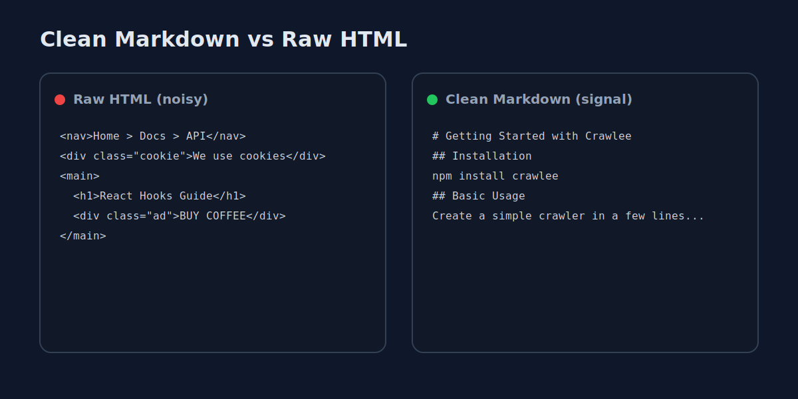

# RAG Web Scraper: Website to Markdown

**Turn any website into clean, token-efficient Markdown ready for RAG and LLM pipelines.**



Most web scrapers return raw HTML soup or noisy text — LLMs don't need that. This project acts as a specialized filter that extracts only the meaningful content, removes boilerplate, and outputs LLM-ready Markdown plus structured JSON you can plug directly into your AI workflows (LangChain, LlamaIndex, Pinecone, etc.).

---

## ⚡ Key Features

| Feature | Description |
| :--- | :--- |
| **🧼 Clean Markdown** | Removes navs, footers, ads, and cookie banners automatically. |
| **🧠 RAG Chunking** | Splits content into token-sized chunks (default: 600) for Vector DBs. |
| **🐢/⚡ Hybrid Mode** | Starts fast (Cheerio). Auto-switches to Playwright if it detects a React/Next.js SPA. |
| **💡 Q&A Optimized** | Preserves context on StackOverflow/Discourse style pages (Question + Answer). |
| **💰 Efficient Cost** | Hybrid engine keeps compute units low. Pay usage fee only for results. |

---

## 📉 The "Before & After" Test

Don't feed garbage to your AI. See the difference:

### 🔴 Standard Crawl (Raw HTML)
*Contains ~50% noise: menus, scripts, footers.*
```html
<nav>Home > Docs > API</nav>
<div class="cookie-banner">We use cookies! [Accept]</div>
<main>
  <h1>React Hooks Guide</h1>
  <div class="sidebar">Join our Discord!</div>
  <p>Hooks are a new addition in React 16.8.</p>
  <div class="ad-container">BUY COFFEE NOW</div>
</main>
<footer>© 2026 Meta Platforms, Inc.</footer>
```
**Result:** High token costs, potential hallucinations.

### 🟢 RAG Web Scraper (Markdown)
*Contains 100% signal.*

```markdown
# Getting Started with Crawlee

## Installation

Install Crawlee using npm:

npm install crawlee

## Basic Usage

Create a simple crawler in just a few lines of code...
```

**Result:** Cheap embedding, accurate answers.

---

## 💰 Pricing
**$2.00 usage fee per 1,000 pages**

We use a smart hybrid engine (Cheerio first) to keep compute costs aggressively low.
*   **Efficiency First:** We attempt fast static extraction first.
*   **Power When Needed:** We only launch a full browser (Playwright) if absolutely necessary.
*   **Fair Usage:** You pay a small usage fee + standard compute units.

> **Why this model?** It ensures you get the lowest possible price for simple sites, while guaranteeing capability for complex SPAs.

---

## 🚀 Usage

### 1. Simple Run
Perfect for testing or small docs.
```json
{
  "startUrl": "https://docs.python.org/3/",
  "maxPages": 20
}
```

### 2. Advanced Run (RAG Pipeline)
Optimized for Vector Databases.
```json
{
  "startUrl": "https://react.dev",
  "maxPages": 100,
  "includePaths": ["/learn/*"],
  "excludePaths": ["/community/*"],
  "chunkSize": 500,
  "outputFormat": "json",
  "enableChunking": true
}
```

### 🧠 Apify Run Options (Memory)
If you plan to scrape **more than 20 pages** in a single run, it's recommended to **increase memory** in the Apify *Run options* (e.g., 2–4 GB) to avoid timeouts and ensure stable crawling.

## ⚙️ Configuration

| Option | Type | Default | Description |
| :--- | :--- | :--- | :--- |
| `startUrl` | String | (Required) | The URL to start crawling from. |
| `maxPages` | Integer | 20 | Maximum number of pages to crawl. |
| `maxDepth` | Integer | 2 | How deep to follow links (0 = start page only). |
| `outputFormat` | String | `json` | **`json`**: Structured RAG chunks + metadata.<br>**`markdown`**: Plain .md files.<br>**`both`**: Returns both formats. |
| `chunkSize` | Integer | 600 | Target size for chunks in tokens. Ideal for embeddings. |
| `includePaths` | Array | `[]` | Only crawl URLs matching these patterns (e.g. `/docs/*`). |
| `excludePaths` | Array | `[]` | Skip URLs matching these patterns. |
| `enableChunking`| Boolean | `true` | Enable smart chunking. Disable for full-page markdown only. |
| `stripReferences`| Boolean | `true` | Removes academic references/bibliography sections. |
| `usePlaywright` | Boolean | `false` | Force browser rendering (auto-detected by default). |

---

## 🛠️ Technical Details

### Smart Hybrid Crawling
We don't waste resources. The scraper starts in **Fast Mode** (Cheerio). If it detects a Single Page Application (React, Vue, Next.js), it automatically upgrades to **Browser Mode** (Playwright) to render the content correctly. You get the best of both worlds: speed when possible, power when needed.

### Q&A Intelligence
Most scrapers flatten forums into a wall of text. We detect Q&A structures (StackOverflow, Discourse) and preserve the relationship between the Question and the Accepted Answer, ensuring your RAG system understands the context.

### Noise Removal
We aggressively strip:
*   Navigation bars & Mega-menus
*   Footers & Legal disclaimers
*   Cookie consent banners & Popups
*   "Related Posts" widgets
*   Academic References/Bibliographies

---

## 📤 Output Formats

### JSON (Recommended for RAG)
Returns an array of objects with metadata and chunks.
```json
{
  "url": "https://example.com",
  "title": "Page Title",
  "markdown": "# Page Title\n\nContent...",
  "chunks": [
    { "content": "Chunk 1...", "tokens": 450 },
    { "content": "Chunk 2...", "tokens": 300 }
  ]
}
```

### Markdown
Returns a single Markdown file per page (or combined), perfect for archiving or direct LLM context.

---

## 🙋 FAQ

**Q: Does it work on sites behind login?**
A: Currently designed for public documentation and content sites.

**Q: How do you count pages?**
A: Only successfully scraped pages count. If a page fails or is skipped, you aren't charged.

**Q: Can I use this with LangChain?**
A: Yes! The JSON output is designed to be directly loaded into LangChain's `ApifyDatasetLoader`.
