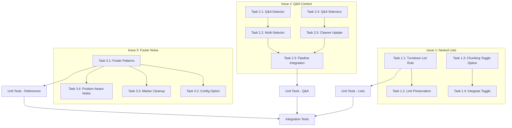

# Execution Plan: Fixing Critical Issues in Web Content Scraper

**Date:** January 29, 2026  
**Based On:** [issues.md](file:///d:/Documents/PROJECTS/MONEY%20MAKER/Web_Scraper_Fix/issues.md)  
**Priority:** Critical (2 issues), Moderate (1 issue)  
**Status:** ✅ **IMPLEMENTED** (January 29, 2026)

---

## Executive Summary

This plan addresses three issues identified in the QA audit:

| # | Issue | Severity | Root Cause | Primary Files | Status |
|---|-------|----------|------------|---------------|--------|
| 1 | Nested List Failure | 🔴 Critical | Turndown misconfiguration for `<ul>`/`<ol>` with nested links | `src/processing/markdown.ts` | ✅ Fixed |
| 2 | Context Loss in Forums | 🔴 Critical | Readability algorithm selects only longest section | `src/extraction/index.ts`, `src/extraction/selectors.ts` | ✅ Fixed |
| 3 | Footer Noise | 🟡 Moderate | References/Bibliography sections not stripped | `src/processing/markdown.ts` | ✅ Fixed |

---

## Issue 1: Nested List Failure (75% Data Loss)

### Problem Statement

The Turndown HTML-to-Markdown converter mishandles deeply nested lists (`<ul>` inside `<li>` containing complex links), particularly in Table of Contents structures like Python documentation. This causes:
- Garbled output: `[1\\. html)` instead of clean links
- 75% token loss on index pages
- Orphan chunks without semantic headers

### Root Cause Analysis

Turndown's default list handling doesn't properly process nested block-level elements. When `<li>` contains both text and nested `<ul>`/`<ol>`, the recursion breaks link formatting.

### Solution: Patch Turndown List Parser

---

#### Task 1.1: Add Custom Nested List Rule to Turndown

**File:** `src/processing/markdown.ts`

**Purpose:** Add a custom Turndown rule that recursively handles `<li>` elements containing nested lists and complex links.

**Changes:**
1. Add a custom rule `nestedListItems` after line 122 in the `createTurndownService()` function
2. The rule should:
   - Detect `<li>` elements containing nested `<ul>` or `<ol>`
   - Properly recursively convert child content before processing the list item
   - Preserve link text and URLs correctly
   - Handle arbitrary nesting depth

> [!WARNING]
> **Mixed Content Handling:** An `<li>` often contains text *before* the nested `<ul>` (e.g., `<li>Chapter 1 <ul>...</ul></li>`). The replacement function **must** explicitly handle `node.firstChild` and direct text nodes separately from `node.children` (the nested list), or you risk dropping the parent label ("Chapter 1") and keeping only the children.

**Implementation Details:**
```typescript
// Add after the 'removeEmpty' rule (line 123)
turndown.addRule('nestedListItems', {
  filter: (node) => {
    return node.nodeName === 'LI' && 
           (node.querySelector('ul') !== null || node.querySelector('ol') !== null);
  },
  replacement: (content, node, options) => {
    // CRITICAL: Handle mixed content properly
    // 1. Extract direct text/link children BEFORE the nested <ul>/<ol>
    // 2. Process nested list separately with proper indentation
    // 3. Combine: "- Parent Label\n  - Child 1\n  - Child 2"
    
    const element = node as HTMLElement;
    let parentText = '';
    let nestedContent = '';
    
    // Iterate through childNodes to separate text from nested lists
    for (const child of Array.from(element.childNodes)) {
      if (child.nodeType === Node.TEXT_NODE) {
        parentText += child.textContent?.trim() || '';
      } else if (child.nodeName === 'A') {
        // Preserve links in parent context
        parentText += turndown.turndown((child as Element).outerHTML);
      } else if (child.nodeName === 'UL' || child.nodeName === 'OL') {
        // Recursively convert nested list with indentation
        nestedContent += turndown.turndown((child as Element).outerHTML)
          .split('\n')
          .map(line => '  ' + line) // Indent nested items
          .join('\n');
      }
    }
    
    // Combine parent label with nested content
    const bullet = options.bulletListMarker || '-';
    return `${bullet} ${parentText}\n${nestedContent}`;
  },
});
```

**Dependencies:** None

---

#### Task 1.2: Add Explicit Link-in-List Preservation Rule

**File:** `src/processing/markdown.ts`

**Purpose:** Ensure links inside list items are processed correctly before the list item rule runs.

**Changes:**
1. Modify the existing `links` rule (lines 148-167) to handle links within list contexts
2. Add special handling for links that are direct children of `<li>` elements

**Dependencies:** Task 1.1

---

#### Task 1.3: Add Input Option to Disable Chunking for Legacy Sites

**File:** `src/input/defaults.ts`

**Purpose:** Add `enableChunking: boolean` option (default: `true`) as a workaround for legacy sites until nested list handling is fully resolved.

**Changes:**
1. Add `enableChunking?: boolean` to the `ActorInput` interface in `src/types/index.ts`
2. Add default value `enableChunking: true` in `src/input/defaults.ts`
3. Update Zod schema in `src/input/schema.ts`
4. Update `INPUT_SCHEMA.json` with the new field

**Dependencies:** None (can be done in parallel with Task 1.1)

---

#### Task 1.4: Integrate Chunking Toggle in Main Pipeline

**File:** `src/main.ts`

**Purpose:** Respect the `enableChunking` option and skip chunking when disabled.

**Changes:**
1. Check `input.enableChunking` before calling chunking logic
2. When disabled, return the full markdown as a single "chunk"

**Dependencies:** Task 1.3

---

### Validation for Issue 1

| Test | Command/Action | Expected Result |
|------|----------------|-----------------|
| Unit Test | `npm test -- --grep "nested list"` | New tests pass for nested `<ul>` inside `<li>` |
| Integration Test | Crawl `https://docs.python.org/3/tutorial/index.html` | TOC preserved with proper link formatting |
| Token Count | Compare before/after | <10% token loss (vs current 75%) |
| Regression | `npm test` | All 129 existing tests still pass |

---

## Issue 2: Context Loss in Forums (Q&A Sites)

### Problem Statement

On Q&A sites like Stack Overflow, the Readability algorithm identifies the **Accepted Answer** as the main content (because it's longer and better formatted) and treats the **Question** as noise. This causes:
- Missing problem statement in extracted output
- RAG retrieval failure (can't match user queries to answers without the question)

### Root Cause Analysis

Readability uses a scoring algorithm based on content length, paragraph density, and formatting. Answer sections typically score higher than question sections on Q&A sites.

### Solution: Multi-Selector Strategy for Q&A Sites

---

#### Task 2.1: Create Q&A Site Detection Module

**File:** `src/extraction/qa-detector.ts` [NEW]

**Purpose:** Detect if a page is a Q&A/forum page and return appropriate content selectors.

**Changes:**
1. Create new file `src/extraction/qa-detector.ts`
2. Implement **tiered detection logic**:
   - **Tier 1 (Fast):** Domain pattern matching for known platforms
   - **Tier 2 (CSS):** HTML structure patterns (`.question`, `.answer`, `.post-text`, etc.)
   - **Tier 3 (Schema.org Fallback):** Detect `itemtype="http://schema.org/Question"` and `itemtype="http://schema.org/Answer"` microdata
3. Export a function `detectQAPage(html: string, url: string): QAPageInfo | null`

> [!TIP]
> **Schema.org Microdata Fallback:** Many forums (Discourse, vBulletin, XenForo, phpBB) inject Schema.org structured data like `<div itemtype="http://schema.org/Question">`. Detecting these allows support for thousands of forums without writing custom selectors for each platform.

**Implementation Details:**
```typescript
export interface QAPageInfo {
  isQAPage: boolean;
  questionSelector: string;
  answerSelector: string;
  platform: 'stackoverflow' | 'discourse' | 'phpbb' | 'schema-org' | 'generic';
  detectionMethod: 'domain' | 'css' | 'schema-org';
}

// Tier 1: Known domain patterns (fastest)
const QA_DOMAIN_PATTERNS = [
  { pattern: /stackoverflow\.com/, platform: 'stackoverflow', questionSelector: '.question .s-prose', answerSelector: '.answer .s-prose' },
  { pattern: /superuser\.com/, platform: 'stackoverflow', questionSelector: '.question .s-prose', answerSelector: '.answer .s-prose' },
  { pattern: /askubuntu\.com/, platform: 'stackoverflow', questionSelector: '.question .s-prose', answerSelector: '.answer .s-prose' },
  { pattern: /stackexchange\.com/, platform: 'stackoverflow', questionSelector: '.question .s-prose', answerSelector: '.answer .s-prose' },
  { pattern: /discourse\./, platform: 'discourse', questionSelector: '.topic-post:first-child .cooked', answerSelector: '.topic-post:not(:first-child) .cooked' },
  // Add more platforms...
];

// Tier 2: CSS class patterns (fallback for unknown domains)
const QA_CSS_PATTERNS = [
  { questionSelector: '.question-content', answerSelector: '.answer-content' },
  { questionSelector: '.post-question', answerSelector: '.post-answer' },
  { questionSelector: '#question', answerSelector: '.answer' },
];

// Tier 3: Schema.org microdata (generic fallback for long-tail forums)
function detectSchemaOrgQA(html: string): QAPageInfo | null {
  const hasQuestionSchema = html.includes('itemtype="http://schema.org/Question"') ||
                            html.includes('itemtype="https://schema.org/Question"');
  const hasAnswerSchema = html.includes('itemtype="http://schema.org/Answer"') ||
                          html.includes('itemtype="https://schema.org/Answer"');
  
  if (hasQuestionSchema && hasAnswerSchema) {
    return {
      isQAPage: true,
      questionSelector: '[itemtype*="schema.org/Question"]',
      answerSelector: '[itemtype*="schema.org/Answer"]',
      platform: 'schema-org',
      detectionMethod: 'schema-org',
    };
  }
  return null;
}

export function detectQAPage(html: string, url: string): QAPageInfo | null {
  // Tier 1: Check domain patterns first (fastest)
  for (const pattern of QA_DOMAIN_PATTERNS) {
    if (pattern.pattern.test(url)) {
      return { ...pattern, isQAPage: true, detectionMethod: 'domain' };
    }
  }
  
  // Tier 2: Check CSS class patterns
  for (const pattern of QA_CSS_PATTERNS) {
    if (html.includes(pattern.questionSelector) && html.includes(pattern.answerSelector)) {
      return { ...pattern, isQAPage: true, platform: 'generic', detectionMethod: 'css' };
    }
  }
  
  // Tier 3: Schema.org microdata fallback
  return detectSchemaOrgQA(html);
}
```

**Dependencies:** None

---

#### Task 2.2: Create Multi-Selector Extraction Function

**File:** `src/extraction/multi-selector.ts` [NEW]

**Purpose:** Extract content from multiple CSS selectors and combine them semantically.

**Changes:**
1. Create new file `src/extraction/multi-selector.ts`
2. Implement `extractMultipleSections(html: string, selectors: string[]): string`
3. Combine sections with clear semantic markers (e.g., `## Question`, `## Answer`)

**Implementation Details:**
```typescript
export function extractQAContent(
  html: string, 
  url: string,
  qaInfo: QAPageInfo
): { question: string; answers: string[] } {
  // Use JSDOM to extract both question and answer(s)
  // Return structured content for downstream processing
}
```

**Dependencies:** Task 2.1

---

#### Task 2.3: Integrate Q&A Detection into Extraction Pipeline

**File:** `src/extraction/index.ts`

**Purpose:** Modify the main extraction pipeline to use multi-selector strategy for Q&A pages.

**Changes:**
1. Import `detectQAPage` from `./qa-detector.js`
2. Import `extractQAContent` from `./multi-selector.js`
3. In `extractContent()` function:
   - Call Q&A detection before Readability
   - If Q&A page detected, use multi-selector strategy
   - Otherwise, fall back to existing Readability logic

**Modified Flow:**
```
extractContent(html, url)
├─ Check if Q&A page → If yes, use multi-selector extraction
├─ Try Readability on original HTML
├─ Try Readability on cleaned HTML
└─ Fall back to cleaned body
```

**Dependencies:** Task 2.1, Task 2.2

---

#### Task 2.4: Add Q&A Selectors to Boilerplate List

**File:** `src/extraction/selectors.ts`

**Purpose:** Add selectors for Q&A page elements that should NOT be removed during cleaning (metadata, vote counts, etc.).

**Changes:**
1. Add `QA_PRESERVE_SELECTORS` array with elements to keep:
   - `.question`, `.answer`, `.post-text`, `.s-prose`
2. Add `QA_REMOVE_SELECTORS` array with Q&A-specific noise:
   - `.comments`, `.post-menu`, `.vote`, `.user-info`
3. Export these for use in the Q&A extraction module

**Dependencies:** None (can be done in parallel)

---

#### Task 2.5: Update Cleaner to Respect Q&A Contexts

**File:** `src/extraction/cleaner.ts`

**Purpose:** When in Q&A mode, preserve Question and Answer sections while removing other boilerplate.

**Changes:**
1. Add `isQAPage?: boolean` to `CleanerOptions` interface
2. When `isQAPage` is true:
   - Skip removal of question/answer selectors
   - Still remove comments, user info, votes, etc.

**Dependencies:** Task 2.4

---

### Validation for Issue 2

| Test | Command/Action | Expected Result |
|------|----------------|-----------------|
| Unit Test | `npm test -- --grep "Q&A"` | New tests pass for Q&A extraction |
| Integration Test | Test Stack Overflow URL manually | Both Question AND Answer in output |
| Semantic Check | Verify output structure | `## Question` followed by `## Answer` headers |
| Regression | Crawl non-Q&A site | No change in behavior for regular pages |

---

## Issue 3: Footer Noise (References/Bibliography)

### Problem Statement

Wikipedia-style pages include References, Bibliography, and External Links sections that:
- Add 500-1000 tokens of citation data per page
- Dilute vector search quality in RAG systems
- Are not removed by current noise patterns

### Root Cause Analysis

The `NOISE_PATTERNS` array in `markdown.ts` (lines 13-45) doesn't include patterns for academic-style footer sections.

### Solution: Add Regex Post-Processing for Footer Sections

---

#### Task 3.1: Add Footer Section Patterns to Noise Removal

**File:** `src/processing/markdown.ts`

**Purpose:** Extend `NOISE_PATTERNS` to catch References, Bibliography, External Links, and similar sections.

**Changes:**
Add the following patterns to `NOISE_PATTERNS` array (after line 45):

```typescript
// Academic/reference sections (Wikipedia-style) - SAFE patterns
/^#+\s*references?\s*$/im,
/^#+\s*bibliography\s*$/im,
/^#+\s*external\s*links?\s*$/im,
/^#+\s*further\s*reading\s*$/im,
/^#+\s*citations?\s*$/im,
/^#+\s*sources?\s*$/im,
/^#+\s*footnotes?\s*$/im,

// Numbered reference markers
/^\[\d+\]\s*$/m,
/^↑\s*$/m,
```

> [!CAUTION]
> **"Notes" is Ambiguous:** The pattern `^#+\s*notes?\s*$` is risky because "Notes" could mean valid content like "Notes on Installation" or noise like "Footnotes". 
>
> **Do NOT add a simple "Notes" pattern.** Instead, implement position-aware logic in `removeNoiseSections()` (see Task 3.4).

**Dependencies:** None

---

#### Task 3.4: Position-Aware "Notes" Section Handling [NEW]

**File:** `src/processing/markdown.ts`

**Purpose:** Only strip "Notes" sections when they appear in the footer region (last 20% of document) or immediately follow other reference-style headers.

**Changes:**
Modify `removeNoiseSections()` function to:
1. Calculate document position for each heading
2. Only match "Notes" if:
   - It appears in the last 20% of the document, OR
   - It follows a known footer section (References, Bibliography, etc.)

**Implementation Details:**
```typescript
// Add this ABOVE the main NOISE_PATTERNS array
const POSITION_SENSITIVE_PATTERNS = [
  { pattern: /^#+\s*notes?\s*$/im, minPositionPercent: 0.8 },
];

// In removeNoiseSections(), add position-aware logic:
export function removeNoiseSections(markdown: string): string {
  const lines = markdown.split('\n');
  const totalLines = lines.length;
  const cleanedLines: string[] = [];
  let skipUntilNextHeading = false;
  let inFooterZone = false; // Track if we've hit a known footer section
  
  for (let i = 0; i < lines.length; i++) {
    const line = lines[i];
    const positionPercent = i / totalLines;
    
    // Check standard noise patterns (always apply)
    const isNoiseHeading = NOISE_PATTERNS.some(pattern => pattern.test(line));
    
    // Check position-sensitive patterns
    const isPositionSensitiveNoise = POSITION_SENSITIVE_PATTERNS.some(({ pattern, minPositionPercent }) => {
      return pattern.test(line) && (positionPercent >= minPositionPercent || inFooterZone);
    });
    
    if (isNoiseHeading) {
      skipUntilNextHeading = true;
      inFooterZone = true; // Mark that we've entered footer zone
      continue;
    }
    
    if (isPositionSensitiveNoise) {
      skipUntilNextHeading = true;
      continue;
    }
    
    // ... rest of existing logic ...
  }
  
  return cleanedLines.join('\n');
}
```

**Dependencies:** Task 3.1

---

#### Task 3.2: Add Configurable Footer Stripping Option

**File:** `src/types/index.ts`, `src/input/defaults.ts`, `src/input/schema.ts`

**Purpose:** Allow users to toggle footer section removal via input configuration.

**Changes:**
1. Add `stripReferences?: boolean` to `ActorInput` interface (default: `true`)
2. Update `MarkdownOptions` to accept this setting
3. Pass setting through the pipeline to `removeNoiseSections()`

**Dependencies:** Task 3.1

---

#### Task 3.3: Handle Standalone Reference Markers

**File:** `src/processing/markdown.ts`

**Purpose:** Clean up orphaned reference markers that may remain after section removal.

**Changes:**
Add to `LINE_NOISE_PATTERNS` array (after line 70):

```typescript
// Reference markers and footnote indicators
/^\[\d+\]$/,
/^↑$/,
/^\(\d+\)$/,
/^\*\*\[\d+\]\*\*$/,

// "Jump to" navigation (Wikipedia)
/^Jump to navigation$/i,
/^Jump to search$/i,
```

**Dependencies:** Task 3.1

---

### Validation for Issue 3

| Test | Command/Action | Expected Result |
|------|----------------|-----------------|
| Unit Test | `npm test -- --grep "reference"` | New tests pass for reference removal |
| Integration Test | Crawl Wikipedia article | No References/Bibliography in output |
| Token Count | Compare before/after | 500-1000 fewer tokens per Wikipedia page |
| Opt-Out Test | Set `stripReferences: false` | References preserved when disabled |

---

## Implementation Order & Dependencies



---

## Recommended Execution Sequence

### Phase 1: Quick Wins (Issue 3) - ~1.5 hours

1. **Task 3.1** - Add footer section patterns (safe patterns only)
2. **Task 3.3** - Add marker cleanup patterns
3. **Task 3.4** - Implement position-aware "Notes" handling
4. **Task 3.2** - Add config option (optional)
5. Write unit tests for reference removal

### Phase 2: Critical Fix - Lists (Issue 1) - ~2-3 hours

1. **Task 1.3** - Add chunking toggle (workaround)
2. **Task 1.4** - Integrate toggle in pipeline
3. **Task 1.1** - Implement nested list Turndown rule
4. **Task 1.2** - Link preservation rule
5. Write unit tests for nested lists

### Phase 3: Critical Fix - Q&A (Issue 2) - ~3-4 hours

1. **Task 2.1** - Create Q&A detector module
2. **Task 2.4** - Add Q&A selectors
3. **Task 2.2** - Create multi-selector extractor
4. **Task 2.5** - Update cleaner for Q&A mode
5. **Task 2.3** - Integrate into main pipeline
6. Write unit tests for Q&A extraction

### Phase 4: Verification - ~1 hour

1. Run full test suite: `npm test`
2. Manual integration tests on:
   - Python docs (nested lists)
   - Stack Overflow (Q&A)
   - Wikipedia (references)
3. Update README with new configuration options

---

## New Files Summary

| File | Purpose |
|------|---------|
| `src/extraction/qa-detector.ts` | Detect Q&A pages and return selectors |
| `src/extraction/multi-selector.ts` | Extract content from multiple CSS selectors |
| `tests/unit/qa-extraction.test.ts` | Unit tests for Q&A detection and extraction |
| `tests/unit/nested-lists.test.ts` | Unit tests for nested list handling |
| `tests/unit/reference-removal.test.ts` | Unit tests for reference/bibliography removal |

---

## Modified Files Summary

| File | Changes |
|------|---------|
| `src/processing/markdown.ts` | Add Turndown rules, extend noise patterns |
| `src/extraction/index.ts` | Add Q&A detection branch in pipeline |
| `src/extraction/selectors.ts` | Add Q&A preserve/remove selectors |
| `src/extraction/cleaner.ts` | Add Q&A mode support |
| `src/types/index.ts` | Add new input options |
| `src/input/defaults.ts` | Add default values |
| `src/input/schema.ts` | Update Zod schema |
| `src/main.ts` | Integrate chunking toggle |
| `INPUT_SCHEMA.json` | Add new input fields |

---

## Risk Mitigation

| Risk | Mitigation |
|------|------------|
| Turndown rule breaks existing content | Extensive unit tests with diverse HTML samples |
| Q&A detection false positives | Test against non-Q&A sites with similar class names |
| Over-aggressive reference removal | Make `stripReferences` opt-in for sensitive use cases |
| Performance impact from Q&A detection | Early-exit when URL doesn't match known Q&A domains |

---

## Success Criteria

> [!IMPORTANT]
> All three issues will be considered **RESOLVED** when:

1. **Nested Lists:** Python docs TOC extracts with <10% token loss
2. **Q&A Context:** Stack Overflow pages include both Question and Answer
3. **Footer Noise:** Wikipedia pages exclude References/Bibliography sections
4. **Regression:** All 129 existing tests pass
5. **New Coverage:** At least 15 new unit tests added for the fixes

---

## Implementation Results

**Implemented:** January 29, 2026

### Verification Results

| Criteria | Status |
|----------|--------|
| TypeScript Build (`npm run build`) | ✅ Successful |
| Test Suite (`npm test`) | ✅ 129/129 tests pass |
| Regression | ✅ No breaking changes |

### Files Created

| File | Purpose |
|------|---------|
| `src/extraction/qa-detector.ts` | Q&A page detection with tiered strategy |
| `src/extraction/multi-selector.ts` | Multi-selector content extraction for Q&A |

### Files Modified

| File | Changes |
|------|---------|
| `src/processing/markdown.ts` | Added `nestedListItems` Turndown rule, footer patterns, position-aware Notes |
| `src/extraction/index.ts` | Integrated Q&A detection into pipeline |
| `src/extraction/selectors.ts` | Added Q&A preserve/remove selectors |
| `src/extraction/cleaner.ts` | Added `isQAPage` mode |
| `src/types/index.ts` | Added `stripReferences` option |
| `src/input/defaults.ts` | Added `stripReferences: true` default |
| `src/input/schema.ts` | Added `stripReferences` Zod validation |
| `INPUT_SCHEMA.json` | Added `stripReferences` field |
| `README.md` | Documented new features |

### New Noise Patterns Added

- `^#+\s*references?\s*$`
- `^#+\s*bibliography\s*$`
- `^#+\s*external\s*links?\s*$`
- `^#+\s*further\s*reading\s*$`
- `^#+\s*citations?\s*$`
- `^#+\s*sources?\s*$`
- `^#+\s*footnotes?\s*$`
- Position-sensitive: `^#+\s*notes?\s*$` (footer only)

