# Web Scraper Actor - Remediation Plan v2

## Problem Statement

Based on the evaluation reports, the Apify actor "Website → LLM-Ready Knowledge Extractor" has **critical issues** that prevent it from being production-ready:

### P0 Critical Issues (from `report.md`)
1. **Not deep crawling** - Only homepage extracted (`pagesAttempted: 1`, `depth: 0`)
2. **Navigation noise dominates** - Navbar, footer, CTAs consuming tokens
3. **Code block quality weak** - Merged blocks, invalid JSON, no language tags
4. **No semantic doc hierarchy** - All content treated as flat markdown

### P1 Issues (from `capabilities_report.md`)
5. **SPA content fragmentation** - Headings split across lines
6. **E-commerce formatting** - Price-product names lack spacing
7. **Listing page token waste** - Index pages extracted with minimal value
8. **Logo/branding noise** - Persistent logo artifacts

---

## Priority-Ordered Phases

### ✅ Phase 1: Enable Deep Crawling (P0) - IMPLEMENTED

**Goal:** Fix the crawler to actually follow documentation links beyond the homepage.

**Status:** Deep crawling logic was already correctly implemented in `handlers.ts`. Added debug logging to trace link extraction. The issue was likely related to SPA rendering (Cheerio vs Playwright) rather than missing functionality.

#### [INVESTIGATE] [handlers.ts](file:///d:/Documents/PROJECTS/MONEY%20MAKER/Web_Scraper_Fix/src/crawler/handlers.ts)

**Current Issue:** Only homepage is crawled (`pagesAttempted: 1`). The crawler is NOT following internal links.

**Investigation Points:**
1. Check `createDefaultHandler()` link extraction logic
2. Verify `enqueueLinks()` is being called with correct selectors
3. Check if `maxDepth` is being respected
4. Verify include/exclude patterns aren't blocking docs links

---

#### [MODIFY] [handlers.ts](file:///d:/Documents/PROJECTS/MONEY%20MAKER/Web_Scraper_Fix/src/crawler/handlers.ts)

**Proposed Fixes:**
1. Ensure links are extracted from the rendered page content
2. For SPAs (Stripe, React, etc.), extract links AFTER Playwright rendering
3. Add logging to trace why links aren't being enqueued
4. Verify `userData.depth` is being incremented correctly

```typescript
// Ensure we're extracting links from the actual page content
const links = await page.$$eval('a[href]', (anchors) => 
  anchors.map(a => a.href).filter(href => href.startsWith('http'))
);
```

---

#### [MODIFY] [index.ts (crawler)](file:///d:/Documents/PROJECTS/MONEY%20MAKER/Web_Scraper_Fix/src/crawler/index.ts)

**Proposed Fixes:**
1. Verify `PlaywrightCrawler` configuration has correct `enqueueLinks` strategy
2. Check `sameDomain` or `sameOrigin` link strategy
3. Ensure request queue is being populated

---

### ✅ Phase 2: Scope Limiting & Link Filtering (P0) - IMPLEMENTED

**Goal:** Stay inside documentation paths, exclude auth/dashboard links.

**Changes Made:**
- Added `DEFAULT_EXCLUDE_PATTERNS` constant in `handlers.ts` with patterns for auth, dashboard, cart, checkout, billing, OAuth, and session URLs
- Applied pattern filtering before link enqueue
- Enhanced Stripe selectors in `docs-detector.ts` with additional removal selectors

#### [MODIFY] [handlers.ts](file:///d:/Documents/PROJECTS/MONEY%20MAKER/Web_Scraper_Fix/src/crawler/handlers.ts)

**Add default exclusion patterns for docs sites:**
```typescript
const DEFAULT_EXCLUDE_PATTERNS = [
  /\/(login|signin|signup|register|auth)\//i,
  /\/(dashboard|console|settings)\//i,
  /\/(cart|checkout|account)\//i,
  /\?redirect=/i,
  /#[^/]*$/,  // Hash-only links
];
```

---

#### [MODIFY] [docs-detector.ts](file:///d:/Documents/PROJECTS/MONEY%20MAKER/Web_Scraper_Fix/src/extraction/docs-detector.ts)

**Add Stripe-specific selectors:**
```typescript
const STRIPE_DOCS_SELECTORS = {
  mainContent: 'main article, [data-docs-content], .DocSearch-content',
  removeSelectors: ['nav', 'header', 'footer', '.sidebar', '[data-sidebar]'],
  linkSelector: 'a[href^="/docs"], a[href^="/api"]',
};
```

---

### ✅ Phase 3: Navigation/Footer Stripping (P1) - IMPLEMENTED

**Goal:** Remove navbar, footer, CTAs to reduce token waste.

**Changes Made:**
- Added enhanced navigation selectors to `selectors.ts`: `[aria-label*="navigation"]`, `.auth-buttons`, `.login-cta`, `[data-testid*="signin"]`, `[data-testid*="signup"]`, `[data-testid*="login"]`
- Added enhanced footer selectors: `.footer-nav`, `.footer-links`, `.footer-menu`, `aside:not([data-content])`
- Added CTA noise patterns to `markdown.ts` LINE_NOISE_PATTERNS for sign-in/signup/start buttons

#### [MODIFY] [cleaner.ts](file:///d:/Documents/PROJECTS/MONEY%20MAKER/Web_Scraper_Fix/src/extraction/cleaner.ts)

**Current Issue:** Navigation and footer content is making it through to the final output.

**Proposed Fixes:**
1. Add more aggressive selectors to `REMOVE_SELECTORS`:
```typescript
const ADDITIONAL_REMOVE_SELECTORS = [
  // Navigation
  '[role="navigation"]',
  '[aria-label*="navigation"]',
  '.navbar', '.nav-bar', '.top-nav',
  
  // Footers
  '[role="contentinfo"]',
  '.site-footer', '.page-footer',
  
  // CTAs and Auth
  '[data-testid*="signin"]',
  '[data-testid*="signup"]',
  '.auth-buttons', '.login-cta',
  
  // Sidebars
  '[role="complementary"]',
  'aside:not([data-content])',
];
```

2. Add content-based filtering for CTA text patterns in markdown post-processing

---

#### [MODIFY] [markdown.ts](file:///d:/Documents/PROJECTS/MONEY%20MAKER/Web_Scraper_Fix/src/processing/markdown.ts)

**Add CTA noise patterns:**
```typescript
const CTA_NOISE_PATTERNS = [
  /^(Sign in|Sign up|Log in|Create account|Get started free)\s*$/im,
  /^(Start now|Try free|Request demo)\s*$/im,
  /^\[(Sign in|Log in|Create account)\]\(.*\)$/im,
];
```

---

### ✅ Phase 4: Code Block Quality Fix (P1) - IMPLEMENTED

**Goal:** Separate CLI vs JSON blocks, preserve valid JSON, add language tags.

**Changes Made:**
- Created new file `src/processing/language-detector.ts` with:
  - `detectLanguageFromClasses()` - detects language from CSS class names
  - `detectLanguageFromContent()` - heuristic language detection from code content
  - `splitMergedCodeBlocks()` - splits CLI+JSON merged blocks
  - `formatJsonBlocks()` - pretty-prints valid JSON in code blocks
  - `improveCodeBlocks()` - applies all improvements
- Integrated into `markdown.ts` post-processing pipeline

#### [MODIFY] [markdown.ts](file:///d:/Documents/PROJECTS/MONEY%20MAKER/Web_Scraper_Fix/src/processing/markdown.ts)

**Current Issue:** 
- CLI commands and JSON responses merged into one block
- JSON is syntactically invalid
- No language tags

**Proposed Fixes:**

1. **Split merged code blocks** - Add post-processing function:
```typescript
function splitCodeBlocks(markdown: string): string {
  // Detect patterns like: curl command followed by JSON response
  // Split into separate fenced blocks
}
```

2. **Validate and format JSON**:
```typescript
function formatJsonInCodeBlocks(markdown: string): string {
  // Find JSON-like blocks
  // Attempt JSON.parse() validation
  // Pretty-print if valid
  // Flag/log if invalid
}
```

3. **Language detection** (from original plan):
```typescript
function detectCodeLanguage(content: string): string {
  if (content.trim().startsWith('{') || content.trim().startsWith('[')) return 'json';
  if (content.includes('curl ') || content.includes('$ ')) return 'bash';
  if (content.includes('import ') || content.includes('require(')) return 'javascript';
  // ... more heuristics
  return 'text';
}
```

---

#### [NEW] [language-detector.ts](file:///d:/Documents/PROJECTS/MONEY%20MAKER/Web_Scraper_Fix/src/processing/language-detector.ts)

**Exports:**
- `detectLanguageFromClasses(className: string): string | null`
- `detectLanguageFromContent(content: string): string`
- `splitMergedCodeBlocks(markdown: string): string`
- `formatJsonBlocks(markdown: string): string`

---

### ✅ Phase 5: SPA Content Consolidation (P2) - IMPLEMENTED

**Goal:** Fix heading fragmentation in SPA-extracted content.

**Changes Made:**
- Added `consolidateHeadings()` function to `markdown.ts`
- Merges continuation lines that follow headings (short non-markdown lines < 60 chars)
- Integrated into `htmlToMarkdown()` post-processing pipeline

---

#### [MODIFY] [markdown.ts](file:///d:/Documents/PROJECTS/MONEY%20MAKER/Web_Scraper_Fix/src/processing/markdown.ts)

**Current Issue:** Lines like `## Go full-stack\nwith a framework` appear as broken headings.

**Implemented Fix:**
```typescript
export function consolidateHeadings(markdown: string): string {
  // Look ahead for continuation lines after headings
  // Merge if: not empty, not heading, not list, not code, < 60 chars
}
```

---

### ✅ Phase 6: E-commerce & Product Formatting (P2) - IMPLEMENTED

**Goal:** Add proper spacing between product names and prices.

**Changes Made:**
- Added `normalizeProductLinks()` function to `markdown.ts`
- Regex transforms `[Product$99.99]` → `[Product - $99.99]`
- Integrated into `htmlToMarkdown()` post-processing pipeline

---

#### [MODIFY] [markdown.ts](file:///d:/Documents/PROJECTS/MONEY%20MAKER/Web_Scraper_Fix/src/processing/markdown.ts)

**Implemented Fix:**
```typescript
export function normalizeProductLinks(markdown: string): string {
  return markdown.replace(
    /\[([^\]]+?)(\$[\d,]+(?:\.\d{2})?)\]/g,
    '[$1 - $2]',
  );
}
```

---

### ✅ Phase 7: Listing Page Detection (P2) - IMPLEMENTED

**Goal:** Skip or flag low-value index/search pages.

**Changes Made:**
- Added `isListingPage()` function to `validator.ts`
- Detection uses 5 signal types: URL patterns, title patterns, link-to-text ratio, list item density, paragraph count
- Added `skipListingPages` option to `INPUT_SCHEMA.json`
- Added `skipListingPages?: boolean` to `ActorInput` interface

---

#### [MODIFY] [validator.ts](file:///d:/Documents/PROJECTS/MONEY%20MAKER/Web_Scraper_Fix/src/processing/validator.ts)

**Implemented:**
```typescript
export function isListingPage(markdown: string, title: string, url: string): boolean {
  // 5 signals: URL patterns, title patterns, link ratio, list density, paragraph count
  // Returns true if 3+ signals match
}
```

#### [MODIFY] [INPUT_SCHEMA.json](file:///d:/Documents/PROJECTS/MONEY%20MAKER/Web_Scraper_Fix/INPUT_SCHEMA.json)

**Added:**
```json
{
  "skipListingPages": {
    "title": "Skip Listing Pages",
    "description": "Skip low-value listing pages (search results, category pages, archives).",
    "type": "boolean",
    "default": false
  }
}
```

---

### ✅ Phase 8: Doc-Type Classification (P2) - IMPLEMENTED

**Goal:** Classify pages as Guide vs API Reference vs Example.

**Changes Made:**
- Created new file `src/extraction/doc-classifier.ts`
- Exports `DocType` type and `classifyDocPage()` function
- Uses 3-tier priority: URL patterns → title patterns → content patterns
- Added `docType?: DocType` field to `PageResult` interface

---

#### [NEW] [doc-classifier.ts](file:///d:/Documents/PROJECTS/MONEY%20MAKER/Web_Scraper_Fix/src/extraction/doc-classifier.ts)

**Purpose:** Detect documentation type from URL and content patterns.

**Exports:**
```typescript
export type DocType = 'guide' | 'api-reference' | 'example' | 'concept' | 'changelog' | 'unknown';

export function classifyDocPage(url: string, title: string, content: string): DocType;
export function getDocTypeLabel(type: DocType): string;
```

**Detection patterns:**
- `/api/`, `/reference/` → `api-reference`
- `/guides/`, `/docs/`, `/getting-started/` → `guide`
- `/examples/`, `/tutorials/` → `example`
- `/concepts/`, `/fundamentals/` → `concept`
- `/changelog`, `/releases` → `changelog`

---

#### [MODIFY] [types/index.ts](file:///d:/Documents/PROJECTS/MONEY%20MAKER/Web_Scraper_Fix/src/types/index.ts)

**Added docType to PageResult:**
```typescript
import type { DocType } from '../extraction/doc-classifier.js';

interface PageResult {
  // ... existing fields
  docType?: DocType;
}
```

---

## Test Coverage

### New Test Files

| File | Tests |
|------|-------|
| `tests/unit/language-detector.test.ts` | Language detection from classes, content heuristics |
| `tests/unit/code-block-splitting.test.ts` | CLI/JSON separation, JSON validation |
| `tests/unit/listing-detection.test.ts` | Search/category page detection |
| `tests/unit/doc-classifier.test.ts` | Doc type classification |
| `tests/integration/deep-crawl.test.ts` | Multi-page crawl verification |

### Updated Test Files

| File | Additional Tests |
|------|------------------|
| `tests/unit/markdown.test.ts` | CTA removal, heading consolidation, product formatting |
| `tests/unit/cleaner.test.ts` | Enhanced nav/footer removal |

---

## Verification Plan

### Automated Tests
```bash
npm run build
npm run lint
npm run test:unit
npm run test:integration
```

### Manual Verification

1. **Deep Crawl Test:**
   ```bash
   npx apify run --input '{"startUrl": "https://docs.stripe.com/payments", "maxPages": 10, "maxDepth": 2}'
   ```
   - Verify `pagesAttempted > 5`
   - Verify pages at `depth: 1` and `depth: 2`

2. **Navigation Stripping Test:**
   - Verify no "Sign in", "Create account" in output
   - Verify no navbar links in chunks

3. **Code Block Test:**
   - Verify JSON blocks are syntactically valid
   - Verify language tags present (`json`, `bash`, etc.)
   - Verify CLI and response blocks separated

4. **Stripe Full Test:**
   - Scrape `https://docs.stripe.com/api/payment_intents`
   - Verify endpoint parameters extracted
   - Verify example code properly formatted

---

## Task Dependencies

```mermaid
graph TD
    subgraph P0[🔴 P0 - Critical]
        A[Phase 1: Deep Crawling]
        B[Phase 2: Link Filtering]
    end
    
    subgraph P1[🟠 P1 - Important]
        C[Phase 3: Nav/Footer Stripping]
        D[Phase 4: Code Block Quality]
    end
    
    subgraph P2[🟡 P2 - Quality]
        E[Phase 5: SPA Consolidation]
        F[Phase 6: Product Formatting]
        G[Phase 7: Listing Detection]
        H[Phase 8: Doc Classification]
    end
    
    A --> B
    B --> C
    C --> D
    D --> E
    E --> F
    F --> G
    G --> H
    
    H --> I[Integration Testing]
```



---

## Effort Estimates

| Priority | Phase | Estimated Effort |
|----------|-------|------------------|
| 🔴 P0 | Phase 1: Deep Crawling | 3-4 hours |
| 🔴 P0 | Phase 2: Link Filtering | 1-2 hours |
| 🟠 P1 | Phase 3: Nav/Footer Stripping | 2 hours |
| 🟠 P1 | Phase 4: Code Block Quality | 3-4 hours |
| 🟡 P2 | Phase 5: SPA Consolidation | 1 hour |
| 🟡 P2 | Phase 6: Product Formatting | 1 hour |
| 🟡 P2 | Phase 7: Listing Detection | 1-2 hours |
| 🟡 P2 | Phase 8: Doc Classification | 1-2 hours |

**Total Estimated Effort:** 14-18 hours

---

## Risk Assessment

| Risk | Likelihood | Impact | Mitigation |
|------|------------|--------|------------|
| Deep crawl causes rate limiting | High | High | Add request delays, respect robots.txt |
| Over-aggressive nav stripping | Medium | Medium | Test on multiple doc sites |
| JSON validation breaks edge cases | Low | Low | Fallback to original content |
| Doc classification misses edge cases | Medium | Low | Default to 'unknown' |

---

## Files Summary

| Priority | Status | File | Purpose |
|----------|--------|------|---------|
| 🔴 P0 | ✅ DONE | `src/crawler/handlers.ts` | Fix link extraction, add depth handling |
| 🔴 P0 | ✅ DONE | `src/crawler/index.ts` | Verify enqueue strategy |
| 🔴 P0 | ✅ DONE | `src/extraction/docs-detector.ts` | Add Stripe selectors |
| 🟠 P1 | ✅ DONE | `src/extraction/cleaner.ts` | Enhanced nav/footer selectors |
| 🟠 P1 | ✅ DONE | `src/processing/markdown.ts` | CTA removal, code splitting, heading consolidation, product formatting |
| 🟠 P1 | ✅ DONE | `src/processing/language-detector.ts` | Language detection + code block utils |
| 🟡 P2 | ✅ DONE | `src/processing/validator.ts` | Listing page detection |
| 🟡 P2 | ✅ DONE | `src/extraction/doc-classifier.ts` | Doc type classification |
| 🟡 P2 | ✅ DONE | `src/types/index.ts` | Add docType to PageResult, skipListingPages to ActorInput |
| 🟡 P2 | ✅ DONE | `INPUT_SCHEMA.json` | skipListingPages option |
